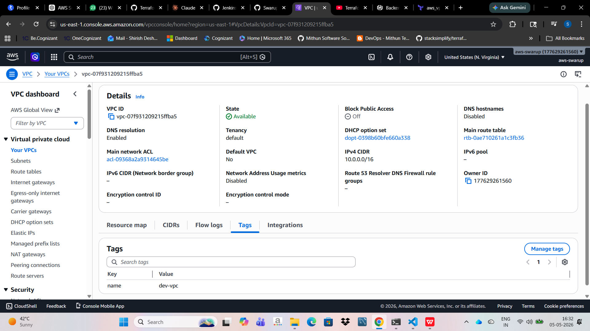
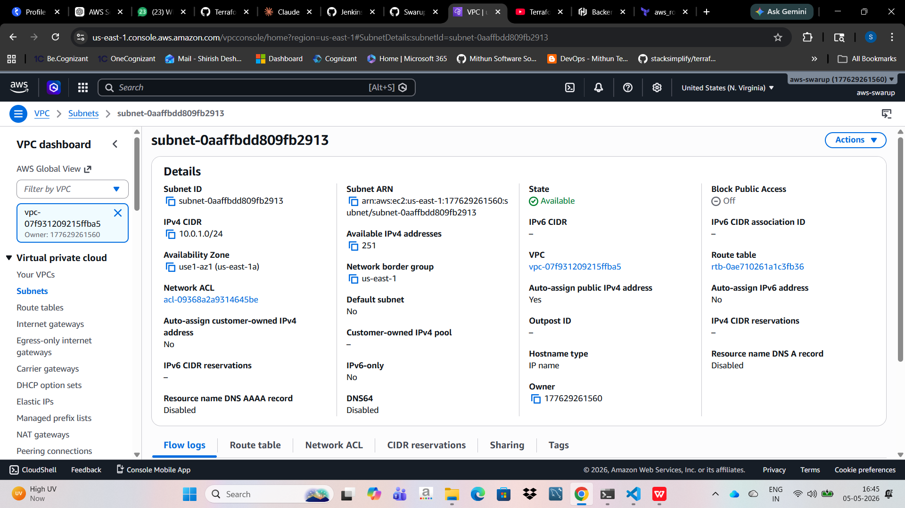
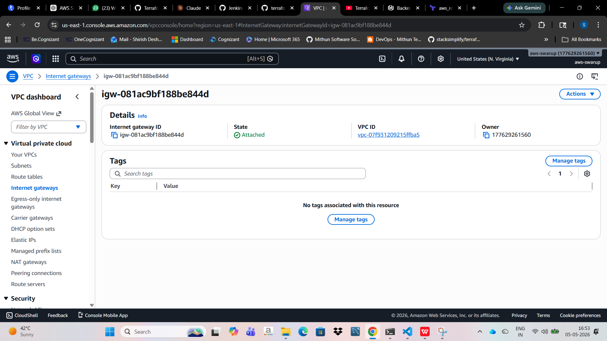
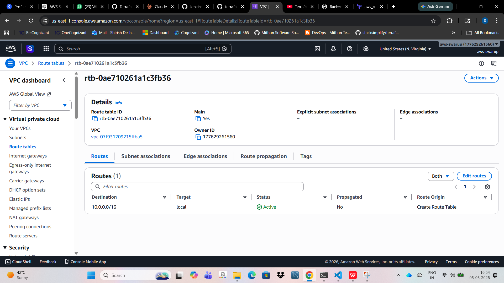
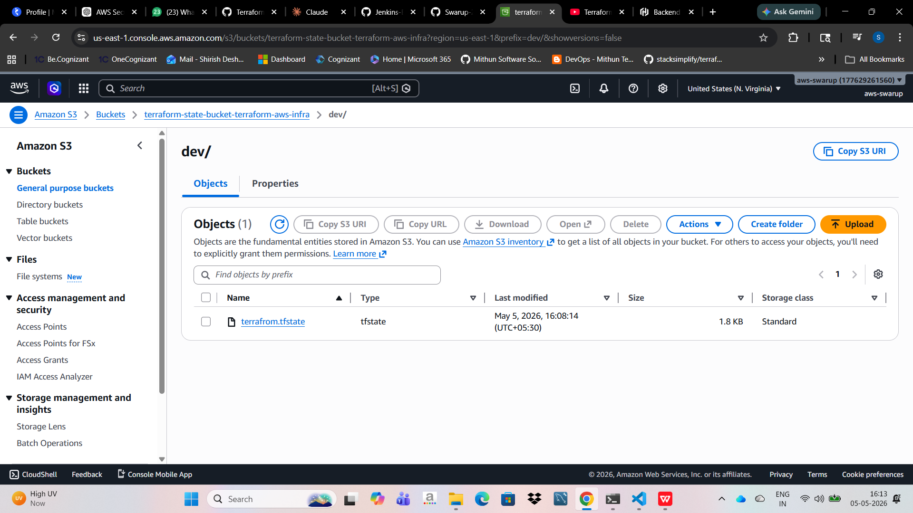
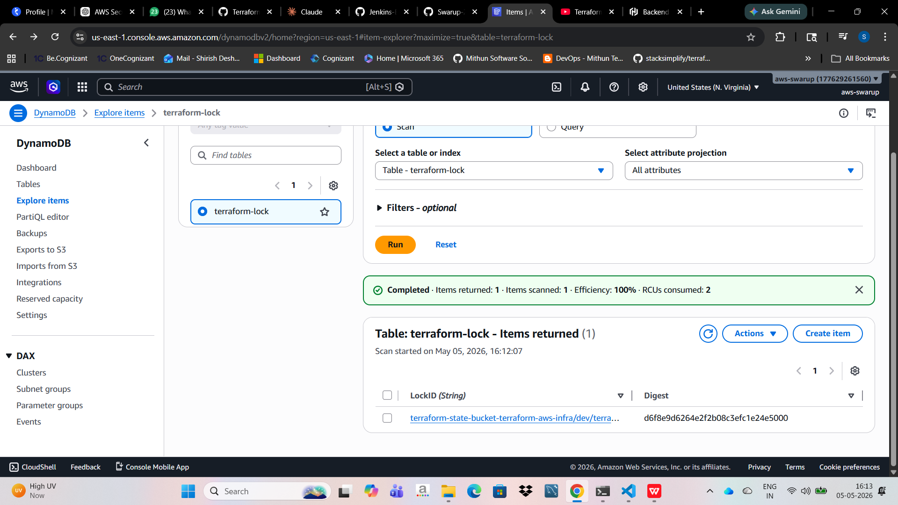

# 🚀 AWS Infrastructure Provisioning with Terraform

## 📌 Overview

This project demonstrates Infrastructure as Code (IaC) using Terraform to provision AWS resources including networking, compute, and remote state management.

---

## 🛠️ Tech Stack

* Terraform
* AWS (VPC, Subnet, EC2, S3, DynamoDB, IAM)
* Git

---

## 🏗️ Architecture Components

### 🌐 1. VPC (Virtual Private Cloud)

* Created a custom VPC with CIDR block
* Acts as isolated network environment



---

### 🏗️ 2. Subnet (Public Subnet)

* Created public subnet inside VPC
* Enabled auto-assign public IP



---

### 🌍 3. Internet Gateway (IGW)

* Attached IGW to VPC for internet access



---

### 🛣️ 4. Route Table

* Configured route table with:

  * `0.0.0.0/0 → IGW`
* Associated subnet with route table



---

### 🔐 5. Security Group

* Allowed:

  * SSH (22)
  * Application Port (8080)

---

### 🖥️ 6. EC2 Instance

* Launched EC2 in public subnet
* Attached security group


---

## 🔒 Remote State Management

### 📦 7. S3 Backend

* Stores Terraform state file securely
* Enabled versioning for recovery



---

### 🔐 8. DynamoDB (State Locking)

* Prevents concurrent Terraform execution
* Ensures safe state management



---

## ⚙️ Terraform Features Used

* Remote backend (S3 + DynamoDB)
* Variables (`.tfvars`)
* Resource dependencies
* Multi-file structure

---

## ▶️ How to Run

### 1. Initialize Terraform

```bash
terraform init
```

### 2. Plan Infrastructure

```bash
terraform plan
```

### 3. Apply Changes

```bash
terraform apply
```

---

## 📂 Project Structure

```
terraform-aws-infra/
│── vpc.tf
│── subnet.tf
│── igw.tf
│── route-table.tf
│── ec2.tf
│── variables.tf
│── backend.tf
│── outputs.tf
```

---

## 🎯 Key Learnings

* Infrastructure provisioning using Terraform
* AWS networking setup (VPC, Subnet, IGW)
* Remote state management best practices
* Secure and scalable infrastructure design

---

## 📌 Future Enhancements

* Add CI/CD pipeline (GitHub Actions)
* Implement Auto Scaling & Load Balancer
* Integrate monitoring (CloudWatch / Prometheus)

---

## 👨‍💻 Author

Swarup Deshmukh
